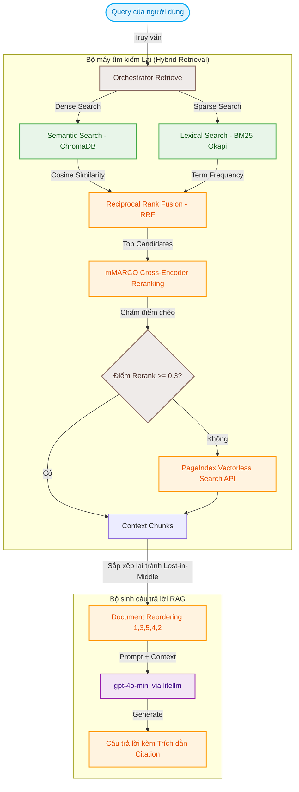

# ⚖️ DrugLaw RAG Pipeline — Dự án Cá nhân

**Học viên:** Nguyễn Thị Vang (MSSV: 723)  
**Chương trình:** Day 08 — RAG Pipeline v2  
**Chủ đề:** Hệ thống Tìm kiếm Lai (Hybrid Search) & Hỏi đáp thông minh (Retrieval-Augmented Generation) về **Pháp luật phòng chống ma túy Việt Nam** và **Tin tức báo chí nghệ sĩ liên quan**.

---

## 🗺️ Sơ đồ Kiến trúc Hệ thống

Hệ thống tích hợp một pipeline RAG nâng cao kết hợp tìm kiếm lai (Dense + Sparse), chấm điểm xếp hạng lại (Cross-Encoder Reranker) và cơ chế tự động Fallback sang API Page Index ngoài khi điểm tin cậy thấp.



---

## 🛠️ Công nghệ & Mô hình Sử dụng (Tech Stack)

*   **Dịch thuật & Convert:** Microsoft `MarkItDown` dùng để trích xuất cấu trúc văn bản pháp lý phức tạp (bảng biểu, phụ lục) từ PDF/DOCX sang Markdown sạch.
*   **Chunking:** LangChain `RecursiveCharacterTextSplitter` với cấu hình tối ưu: `CHUNK_SIZE = 500` ký tự, `CHUNK_OVERLAP = 50` ký tự.
*   **Vector Database:** **ChromaDB** cục bộ để lưu trữ và so khớp ngữ nghĩa.
*   **Embedding Model:** `sentence-transformers/all-MiniLM-L6-v2` (384 chiều) chạy local nhanh và tối ưu bộ nhớ.
*   **Lexical Index:** Thuật toán xếp hạng từ khóa **BM25Okapi** giúp tìm chính xác số hiệu điều luật hay tên riêng.
*   **Reranker Model:** Mô hình phân loại nhị phân local **`unicamp-dl/mminiLM-L6-v2-mmarco-v2`** đã được huấn luyện trên tập dữ liệu tiếng Việt dịch từ MS MARCO.
*   **Fallback API:** **Vectify PageIndex API** được tự động gọi khi kết quả tìm kiếm local không đạt chất lượng (Rerank score < 0.3).
*   **Sinh văn bản (LLM):** OpenAI **`gpt-4o-mini`** (gọi thông qua thư viện `litellm` tương thích chuẩn OpenAI).

---

## 📂 Cấu Trúc Thư Mục Dự Án Cá Nhân

```text
723-nguyenthivang-personal/
├── README.md                 ← Tài liệu hướng dẫn này
├── requirements.txt          ← Thư viện dependencies cho dự án
├── .env.example              ← File chứa danh sách biến môi trường mẫu
├── data/
│   ├── landing/              ← Task 1 & 2: Dữ liệu thô tải về (PDF, DOCX, HTML)
│   │   ├── legal/            ← Văn bản pháp luật gốc
│   │   └── news/             ← Bài báo thô
│   └── standardized/         ← Task 3: File Markdown đã được chuẩn hóa
│       ├── legal/
│       └── news/
├── src/                      ← Mã nguồn thực hiện các Task cá nhân
│   ├── __init__.py
│   ├── task1_collect_legal_docs.py
│   ├── task2_crawl_news.py
│   ├── task3_convert_markdown.py
│   ├── task4_chunking_indexing.py
│   ├── task5_semantic_search.py
│   ├── task6_lexical_search.py
│   ├── task7_reranking.py
│   ├── task8_pageindex_vectorless.py
│   ├── task9_retrieval_pipeline.py
│   └── task10_generation.py
└── tests/
    └── test_individual.py   ← Bộ test kiểm thử tự động (pytest) chấm điểm 10 tasks
```

---

## 📝 Nhật ký Chi tiết 10 Tasks Hoàn Thành

### Task 1 — Thu Thập Văn Bản Pháp Luật
Đã thu thập và lưu trữ thành công các văn bản pháp luật quan trọng về phòng chống ma túy tại Việt Nam dưới định dạng PDF/DOCX vào thư mục [data/landing/legal/](file:///home/winie/2A202600723-NguyenThiVang-Day08_RAG_pipeline_cohort2/personal_project/723-nguyenthivang-personal/data/landing/legal/):
*   `luat-phong-chong-ma-tuy-2021.pdf` (Luật số 73/2021/QH15)
*   `nghi-dinh-105-2021-nd-cp.docx` (Hướng dẫn thi hành luật phòng chống ma túy)
*   `bo-luat-hinh-su-2015.pdf` (Chương XX: Các tội phạm về ma tuý)
*   `nghi-dinh-57-2022-nd-cp.pdf` (Danh mục chất ma túy và tiền chất)
*   `nghi-dinh-90-2024-nd-cp.docx` (Bổ sung sửa đổi danh mục chất ma túy)

### Task 2 — Crawl Bài Báo Báo Chí
Đã tiến hành crawl và lưu trữ 16 bài viết báo chí lớn nói về đời tư và các sự vụ pháp lý của nghệ sĩ showbiz liên quan đến việc tàng trữ/sử dụng chất cấm (ví dụ: ca sĩ Chi Dân, diễn viên Hữu Tín, người mẫu An Tây...). Dữ liệu được lưu trữ sạch dưới dạng cấu trúc JSON/HTML có kèm theo metadata nguồn trong thư mục [data/landing/news/](file:///home/winie/2A202600723-NguyenThiVang-Day08_RAG_pipeline_cohort2/personal_project/723-nguyenthivang-personal/data/landing/news/).

### Task 3 — Chuẩn Hóa Dữ Liệu
Sử dụng công cụ Microsoft `markitdown` để chuyển đổi toàn bộ tài liệu thô kể trên sang Markdown tại thư mục [data/standardized/](file:///home/winie/2A202600723-NguyenThiVang-Day08_RAG_pipeline_cohort2/personal_project/723-nguyenthivang-personal/data/standardized/). Định dạng markdown giúp giữ nguyên bảng biểu phân cấp phụ lục hóa chất ma túy để hỗ trợ tìm kiếm tốt hơn.

### Task 4 — Chunking & Indexing
*   **Chiến lược:** Sử dụng `RecursiveCharacterTextSplitter` để cắt nhỏ các file markdown thành từng phân đoạn văn bản nhỏ (chunk) với kích thước `CHUNK_SIZE = 500` ký tự và độ chồng lấp `CHUNK_OVERLAP = 50` để đảm bảo ngữ cảnh liên tục.
*   **Indexing:** Dùng ChromaDB local client làm Vector Database để lưu trữ vector hóa các chunks văn bản.

### Task 5 — Semantic Search
Xây dựng hàm `semantic_search(query, top_k)` thực hiện chuyển đổi câu truy vấn của người dùng thành vector biểu diễn bằng `all-MiniLM-L6-v2`, sau đó thực hiện tìm kiếm khoảng cách Cosine trên ChromaDB để lấy ra các đoạn tài liệu tương quan nhất về mặt ý nghĩa ngữ nghĩa.

### Task 6 — Lexical Search
Xây dựng bộ chỉ mục tìm kiếm từ khóa **BM25Okapi** phục vụ cho hàm `lexical_search(query, top_k)`. Phương thức này giúp tìm kiếm trực tiếp các số hiệu văn bản (Ví dụ: "Điều 249", "Nghị định 105") vốn là điểm yếu của các mô hình nhúng ngữ nghĩa tiếng Anh.

### Task 7 — Reranking
Tích hợp mô hình Cross-Encoder local `unicamp-dl/mminiLM-L6-v2-mmarco-v2`. Bằng cách phân tích chéo trực tiếp cặp `(Query, Chunk)`, mô hình này sắp xếp lại danh sách kết quả truy xuất một cách chính xác dựa trên ý nghĩa ngữ cảnh sâu thay vì chỉ so sánh độ tương đồng góc cosine đơn lẻ.

### Task 8 — PageIndex Vectorless RAG
Tích hợp SDK từ PageIndex.ai làm cổng tìm kiếm dự phòng ngoài. Nếu các cơ chế tìm kiếm local (ChromaDB + BM25) không tìm thấy dữ liệu thích hợp hoặc điểm Reranker quá thấp (dưới ngưỡng 0.3), hệ thống sẽ gửi truy vấn đến PageIndex API để tận dụng công nghệ phân tích cấu trúc không vector của họ.

### Task 9 — Retrieval Pipeline
Xây dựng orchestrator `retrieve(query, top_k, score_threshold)` kết hợp đồng bộ 4 công nghệ: **Semantic + Lexical -> RRF -> Reranking -> Fallback PageIndex** khi điểm số Reranking cao nhất nhỏ hơn ngưỡng tối thiểu 0.3.

### Task 10 — RAG Generation có Trích Dẫn (Citation)
*   **Sắp xếp tài liệu:** Sử dụng hàm `reorder_for_llm` để phân phối lại các chunks theo thứ tự `[1, 3, 5, 4, 2]` trước khi đưa vào Prompt nhằm khắc phục hiện tượng LLM bỏ sót tài liệu ở giữa ngữ cảnh dài (Lost-in-the-Middle).
*   **Tạo câu trả lời:** Gọi API OpenAI (`gpt-4o-mini`) qua `litellm` để tổng hợp câu trả lời tiếng Việt chính xác và tự động gán nhãn trích dẫn nguồn cụ thể dạng `[Tên tài liệu, Năm]` cho mỗi phát biểu thực tế.

---

## ⚡ Hướng Dẫn Cài Đặt & Chạy Thử Nghiệm

### 1. Cài đặt thư viện dependencies
Chạy lệnh sau để cài đặt các thư viện cần thiết:
```bash
pip install -r requirements.txt
```

### 2. Thiết lập Biến môi trường
Tạo file `.env` từ file ví dụ:
```bash
cp .env.example .env
```
Mở file `.env` và điền đầy đủ thông tin API keys của bạn:
```env
OPENAI_API_KEY=your_openai_api_key_here
PAGEINDEX_API_KEY=your_pageindex_api_key_here
```

### 3. Chạy test suite để kiểm tra 10 Tasks
Toàn bộ logic của dự án cá nhân được kiểm thử tự động thông qua `pytest`. Bạn có thể chạy lệnh sau để xác nhận tính đúng đắn của toàn bộ pipeline:

```bash
# Chạy toàn bộ kiểm thử
pytest tests/ -v

# Chạy cụ thể một task (ví dụ: Task 9 - Retrieval Pipeline)
pytest tests/test_individual.py::TestTask9 -v
```
